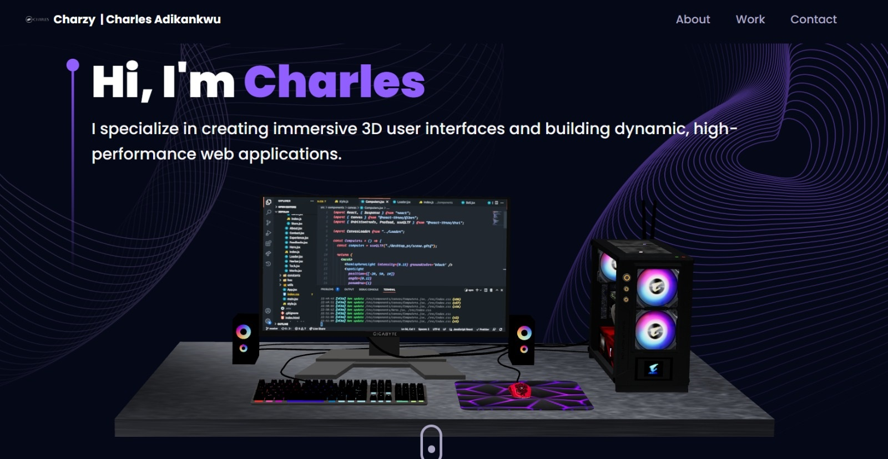

# 3D Personal Portfolio Website

> Welcome to my personal portfolio website! This project showcases my skills, projects, and experience as a software developer. It is built using modern web technologies and is designed to be responsive, interactive, and visually engaging.

# Introduction
This portfolio site is designed to highlight my expertise in software development, including the projects I’ve worked on, technologies I’ve mastered, and the services I provide. The site is fully responsive and works seamlessly across all devices, from desktops to mobile phones.

# Features
- Introduction Section: A brief overview of who I am and my expertise.
- Projects Showcase: Displays a list of projects I’ve worked on, each with a brief description, tech stack, and live demo links (where applicable).
- Services: A section outlining the services I offer, such as web development and consulting.
- 3D Interactive Elements: The site uses 3D animations (via Three.js) to create an immersive user experience.
- Contact Form: Allows visitors to reach out to me directly via EmailJS integration.
- Responsive Design: The website is optimized for both desktop and mobile devices.
- Framer Motion Animations: Smooth animations and transitions for a dynamic user experience.

# Technologies Used
- Frontend:
    - React
    - Tailwind CSS
    - Framer Motion (for animations)
    - React Three Fiber and Drei (for 3D rendering)
    - EmailJS (for contact form integration)

- 3D Models and Assets:
    - Three.js (3D models and animations)
    - Maath/random (for procedural generation of 3D objects)

## Live version

Have a look at the live version here [here](https://charlesadikankwu.netlify.app/).

## Project screenshot.

## Setup

- Get the link of the repository: `https://github.com/Charzy-1/Charles-3D-Portfolio`
- Clone it as `https://github.com/Charzy-1/Charles-3D-Portfolio.git` on a Terminal
- Change directory to it by `cd Charles-3D-Portfolio`

## Usage

- Run `npm install` on a Terminal to install the modules
- Run `npm run dev` on a Terminal to start the server 
- Open [http://localhost:5173/](http://localhost:5173) or check the terminal and hold the control key and click to view it in the browser.

Once the development server is running, you can:

- Navigate through the different sections (About, Projects, Services, Contact).
- Test the 3D interactions and animations.
- Submit a message through the contact form (configured with EmailJS).

## Author

👤 **Charles Adikankwu**

- GitHub: [@githubhandle](https://github.com/Charzy-1)
- Twitter: [@twitterhandle](https://x.com/CharlyB124?t=DqI9VdevQ1kz7k3u2dOOtQ&s=08)
- LinkedIn: [LinkedIn](https://www.linkedin.com/in/charles-adikankwu)

## 🤝 Contributing

Contributions, issues, and feature requests are welcome!

## Show your support

Give a ⭐️ if you like this project!

## Acknowledgments

- Chill Academy
- React, Redux and React Router documentation
- Jest Documentation for Testing.

# React + Vite

This template provides a minimal setup to get React working in Vite with HMR and some ESLint rules.

Currently, two official plugins are available:

- [@vitejs/plugin-react](https://github.com/vitejs/vite-plugin-react/blob/main/packages/plugin-react/README.md) uses [Babel](https://babeljs.io/) for Fast Refresh
- [@vitejs/plugin-react-swc](https://github.com/vitejs/vite-plugin-react-swc) uses [SWC](https://swc.rs/) for Fast Refresh
